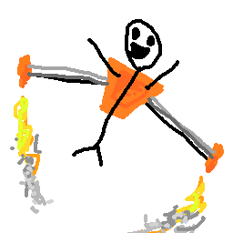

# Mekanism Jetpack Tweaks

//todo: Better readme

This is a mod written for Minecraft Forge (1.18.2) which adds a bunch of extra config options to make the Mekanism jetpack much more... usable. 
You can increase the forward, strafe, and vertical speed individually to make the jetpackcontrol exactly as you expect it to control.

### Where's the config ??

The config is only modifiable via its text file as of right now as the bundled ForgeConfigSpec helper doesn't offer a UI anymore. I plan on adding 
a UI for it eventually but there is no estimated time on when I'll actually get around to that. PRs are welcome if anyone wants to add it sooner.

oh and here: the very professional logo.

